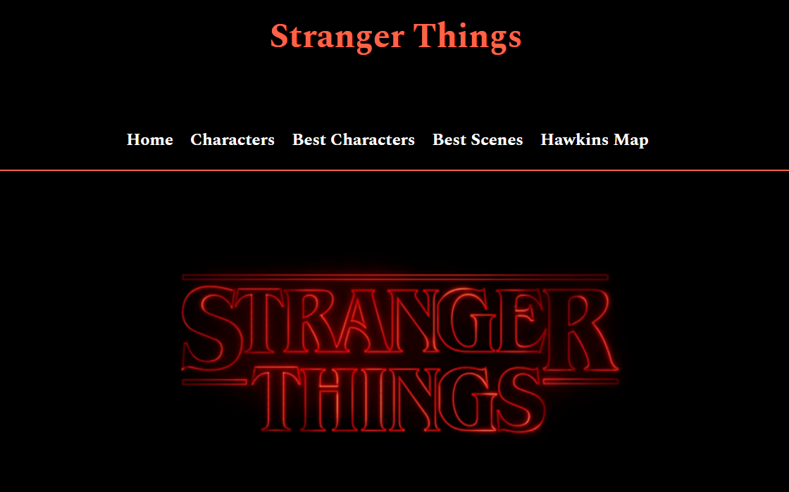

# Stranger Things Fan Webpage
This is a simple stylish fan website based on a popular Netflix series: Stranger Things, using basic HTML and CSS.
This project is built to practice web development fundamentals such as navigation bars using anchor tags, styling, layouts,images, and many more.

# Features
• Attractive Stranger Things themed website
• Information about series and characters
• Build with completely using HTML and CSS

# Technologies Used
• HTML
• CSS

# Purpose of the Project

• Creating a themed fan website
• Improving styling and layout skills
• Practicing frontend web development

# Preview

